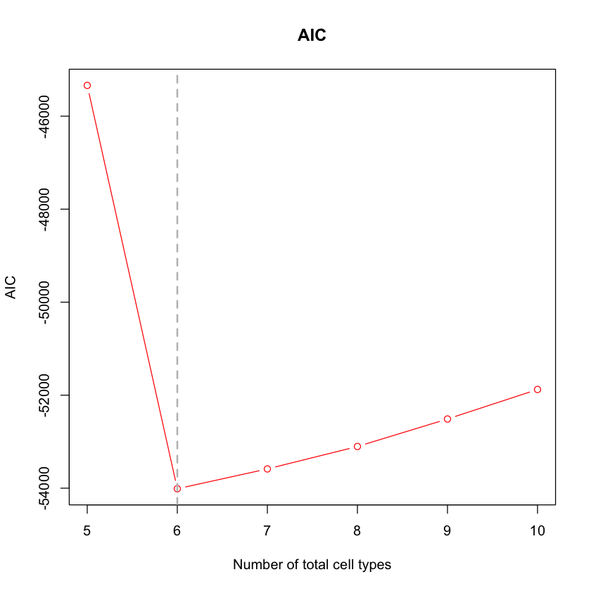
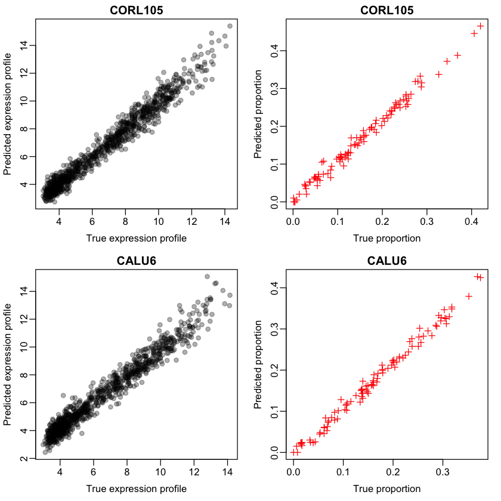

# PREDE - R package for partial reference-based deconvolution

Deconvolution of heterogeneous bulk tumor samples into distinct cell populations is an important yet challenging problem, particularly when only partial references are available. Typical approach dealing with this problem is to regress the mixed signals using available references and leverage the remaining signal as a new cell component. However, as indicated in our simulation study, such approach tends to over-estimate the proportions of known cell types and fails to detect unknown cell types. In this paper, we developed PREDE, a partial reference deconvolution method based on iterative non-negative Matrix Factorization. Our method is verified to be effective in estimating cell proportions and expression profiles of unknown cell types based on simulated datasets at a variety of parameter settings. Applying our method to TCGA tumor samples, we found that cell proportions of cancer cells, rather than infiltrating immune cells, could better separate different subtypes of tumor samples. We also detected a number of cell types for each cancer type, whose proportions successfully predict survival rate of tumor patients. Our method makes a significant contribute to deconvolution of heterogeneous tumor samples and could be widely applied to many types of bulk high throughput data.

<h2>How to install?</h2>
1. Install the devtools package if needed.
<p><code>install.packages("devtools")</code> </p>
2. Load the devtools package.
<p><code>library(devtools)</code> </p>
3. Install PREDE from GitHub. 
<p><code>install_github("Xiaoqizheng/PREDE")</code> 

<h2>How to use?</h2>

```R
library("PREDE")
```


```R
## load data of lung cancer cell lines and select a number of cell lines as references
data(lung_exp)
W <- lung_exp[,1:6]
head(W)
```


<table>
<caption>A matrix: 6 × 6 of type dbl</caption>
<thead>
	<tr><th></th><th scope=col>A549_LUNG</th><th scope=col>CAL12T_LUNG</th><th scope=col>CALU1_LUNG</th><th scope=col>CALU3_LUNG</th><th scope=col>CALU6_LUNG</th><th scope=col>CORL105_LUNG</th></tr>
</thead>
<tbody>
	<tr><th scope=row>X.1</th><td>3.405440</td><td> 3.420208</td><td> 3.345345</td><td> 3.311364</td><td>3.536505</td><td>3.390355</td></tr>
	<tr><th scope=row>HIF3A</th><td>4.556388</td><td> 4.406636</td><td> 4.453265</td><td> 4.561066</td><td>4.607109</td><td>4.140054</td></tr>
	<tr><th scope=row>LOC100859930</th><td>8.619415</td><td> 8.099757</td><td> 8.857715</td><td> 9.024848</td><td>7.891162</td><td>8.416764</td></tr>
	<tr><th scope=row>RNF17</th><td>3.754861</td><td> 4.137410</td><td> 3.743343</td><td> 3.837331</td><td>3.903201</td><td>3.732548</td></tr>
	<tr><th scope=row>RNF10</th><td>7.847993</td><td> 7.400762</td><td> 7.962722</td><td> 7.349897</td><td>7.082205</td><td>8.037870</td></tr>
	<tr><th scope=row>RNF11</th><td>9.491338</td><td>10.066630</td><td>11.268840</td><td>10.575960</td><td>9.322282</td><td>9.839499</td></tr>
</tbody>
</table>


### 1. Generate the mixed samples


```R
## generate bulk data using cell lines as reference
bulk <- generate_bulk(W,nSample =100,csd = 0.1)
```

### 2. Select the feature


```R
## select top features in terms of coefficient of variation (cv) 
feat <- select_feature(mat = bulk$Y,method = "cv",nmarker = 1000,startn = 0)
```


```R
head(feat)
```


<style>
.list-inline {list-style: none; margin:0; padding: 0}
.list-inline>li {display: inline-block}
.list-inline>li:not(:last-child)::after {content: "\00b7"; padding: 0 .5ex}
</style>
<ol class=list-inline><li>'LOC100289026'</li><li>'KRT23'</li><li>'FDCSP'</li><li>'CSN3'</li><li>'GABRP'</li><li>'RGS1'</li></ol>


### 3. Get optimal number of total cell types


```R
## determine the total number of cell types by AIC, by specifying only partial reference W1
OptimalK <- GetCelltypeNum(bulk$Y[feat,],W=NULL,W1=W[feat,1:4],maxK = 10)
```


```R
plot(5:10,OptimalK$AIC, col="red",xlab="Number of total cell types",
     ylab = "AIC",lwd = 1,type = 'b',main = "AIC")
abline(v = 6,lwd = 2,lty = 2,col = "gray")
```





```R
## the optimal value of K with the lowest AIC 
OptimalK$K
```


6


### 4. Partial reference deconvolution (PREDE)


```R
## Run PREDE with the optimal value of K
pred <- PREDE(bulk$Y[feat,],W1=W[feat,1:4],type = "GE",K=OptimalK$K,iters = 100,rssDiffStop=1e-5)
```


```R
## Correlation in expression profiles between true and predicted cell types 
cor(W[feat,],pred$W)
```


<table>
<caption>A matrix: 6 × 6 of type dbl</caption>
<thead>
	<tr><th></th><th scope=col>A549_LUNG</th><th scope=col>CAL12T_LUNG</th><th scope=col>CALU1_LUNG</th><th scope=col>CALU3_LUNG</th><th scope=col>1</th><th scope=col>2</th></tr>
</thead>
<tbody>
	<tr><th scope=row>A549_LUNG</th><td>1.0000000</td><td>0.4825898</td><td>0.5051475</td><td>0.3980509</td><td>0.5051503</td><td>0.4728361</td></tr>
	<tr><th scope=row>CAL12T_LUNG</th><td>0.4825898</td><td>1.0000000</td><td>0.4397227</td><td>0.4177839</td><td>0.4113773</td><td>0.4300118</td></tr>
	<tr><th scope=row>CALU1_LUNG</th><td>0.5051475</td><td>0.4397227</td><td>1.0000000</td><td>0.3316008</td><td>0.4598158</td><td>0.4616742</td></tr>
	<tr><th scope=row>CALU3_LUNG</th><td>0.3980509</td><td>0.4177839</td><td>0.3316008</td><td>1.0000000</td><td>0.4546228</td><td>0.3661860</td></tr>
	<tr><th scope=row>CALU6_LUNG</th><td>0.4629813</td><td>0.3679146</td><td>0.4711973</td><td>0.3211006</td><td>0.3435376</td><td>0.9795787</td></tr>
	<tr><th scope=row>CORL105_LUNG</th><td>0.4713901</td><td>0.4310114</td><td>0.4459747</td><td>0.4662530</td><td>0.9827597</td><td>0.3207378</td></tr>
</tbody>
</table>


 The first four columns are four input known cell types. The last two columns are the predicted new cell types 1 and 2, which should be corresponding to 'CORL105_LUNG' and 'CALU6_LUNG' respectively. 


```R
## plot the results
par(mar = c(3.5, 3, 1.6, 1.1), mgp = c(1.9, 0.5, 0),mfrow = c(2,2))
plot(W[feat,'CORL105_LUNG'],pred$W[,"1"],xlab = "True expression profile",pch = 19,col="#00000050",ylab = "Predicted expression profile",main = "CORL105")
plot(bulk$H[6,],pred$H["1",],xlab = "True proportion",pch = 3,col="red",ylab = "Predicted proportion",main = "CORL105")
plot(W[feat,'CALU6_LUNG'],pred$W[,"2"],xlab = "True expression profile",pch = 19,col="#00000050",ylab = "Predicted expression profile",main = "CALU6")
plot(bulk$H[5,],pred$H["2",],xlab = "True proportion",pch = 3,col="red",ylab = "Predicted proportion",main = "CALU6")
```




