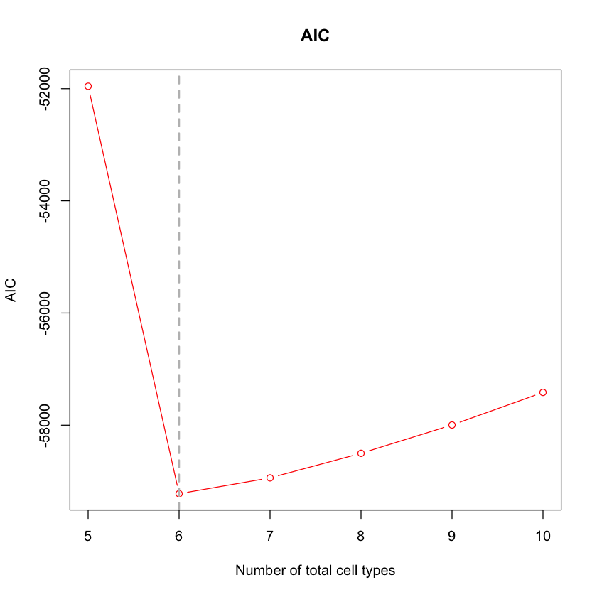
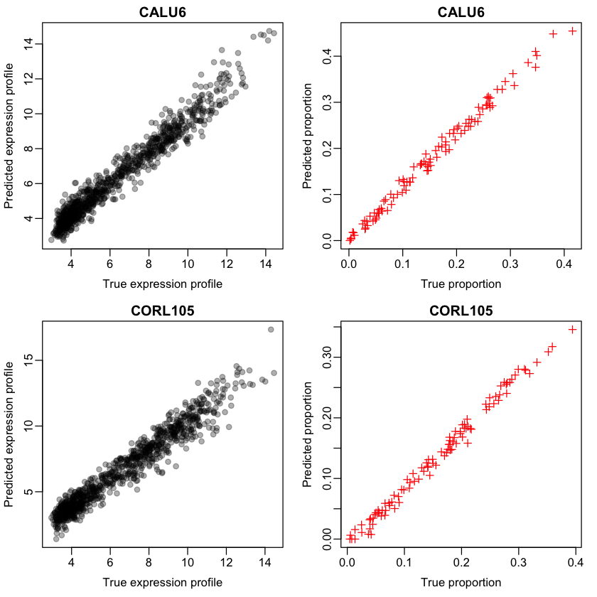

# PREDE - R package for partial reference-based deconvolution

   Deconvolution of heterogeneous bulk tumor samples into distinct cell populations is an important yet challenging problem, particularly when only partial references are available. Here we developed PREDE, a partial reference deconvolution method based on iterative non-negative Matrix Factorization.


```R
set.seed(123)
```

## How to install?
### 1. Install the devtools package if needed


```R
install.packages("devtools")
```

### 2. Load the devtools package


```R
library(devtools)
```

### 3. Install PREDE from GitHub


```R
install_github("Xiaoqizheng/PREDE")
```

    Skipping install of 'PREDE' from a github remote, the SHA1 (6d0083c8) has not changed since last install.
      Use `force = TRUE` to force installation
    


## How to use?


```R
library("PREDE")
```


```R
## load data of lung cancer cell lines and select a number of cell lines as references
data(lung_exp)
W <- lung_exp[,1:6]
head(W)
```


<table>
<caption>A matrix: 6 × 6 of type dbl</caption>
<thead>
	<tr><th></th><th scope=col>A549_LUNG</th><th scope=col>CAL12T_LUNG</th><th scope=col>CALU1_LUNG</th><th scope=col>CALU3_LUNG</th><th scope=col>CALU6_LUNG</th><th scope=col>CORL105_LUNG</th></tr>
</thead>
<tbody>
	<tr><th scope=row>X.1</th><td>3.405440</td><td> 3.420208</td><td> 3.345345</td><td> 3.311364</td><td>3.536505</td><td>3.390355</td></tr>
	<tr><th scope=row>HIF3A</th><td>4.556388</td><td> 4.406636</td><td> 4.453265</td><td> 4.561066</td><td>4.607109</td><td>4.140054</td></tr>
	<tr><th scope=row>LOC100859930</th><td>8.619415</td><td> 8.099757</td><td> 8.857715</td><td> 9.024848</td><td>7.891162</td><td>8.416764</td></tr>
	<tr><th scope=row>RNF17</th><td>3.754861</td><td> 4.137410</td><td> 3.743343</td><td> 3.837331</td><td>3.903201</td><td>3.732548</td></tr>
	<tr><th scope=row>RNF10</th><td>7.847993</td><td> 7.400762</td><td> 7.962722</td><td> 7.349897</td><td>7.082205</td><td>8.037870</td></tr>
	<tr><th scope=row>RNF11</th><td>9.491338</td><td>10.066630</td><td>11.268840</td><td>10.575960</td><td>9.322282</td><td>9.839499</td></tr>
</tbody>
</table>


### 1. Generate the mixed samples


```R
## generate bulk data using cell lines as reference
bulk <- generate_bulk(W,nSample =100,csd = 0.1)
```

### 2. Select the feature


```R
## select top features in terms of coefficient of variation (cv) 
feat <- select_feature(mat = bulk$Y,method = "cv",nmarker = 1000,startn = 0)
```


```R
head(feat)
```


<style>
.list-inline {list-style: none; margin:0; padding: 0}
.list-inline>li {display: inline-block}
.list-inline>li:not(:last-child)::after {content: "\00b7"; padding: 0 .5ex}
</style>
<ol class=list-inline><li>'FDCSP'</li><li>'KRT23'</li><li>'CXCL5'</li><li>'GAGE3'</li><li>'KRT6A'</li><li>'BCHE'</li></ol>


### 3. Get optimal number of total cell types


```R
## determine the total number of cell types by AIC, by specifying only partial reference W1
OptimalK <- GetCelltypeNum(bulk$Y[feat,],W=NULL,W1=W[feat,1:4],maxK = 10)
```


```R
plot(5:10,OptimalK$AIC, col="red",xlab="Number of total cell types",
     ylab = "AIC",lwd = 1,type = 'b',main = "AIC")
abline(v = 6,lwd = 2,lty = 2,col = "gray")
```





```R
## the optimal value of K with the lowest AIC 
OptimalK$K
```


6


### 4. Partial reference deconvolution (PREDE)


```R
## Run PREDE with the optimal value of K
pred <- PREDE(bulk$Y[feat,],W1=W[feat,1:4],type = "GE",K=OptimalK$K,iters = 100,rssDiffStop=1e-5)
```


```R
## Correlation in expression profiles between true and predicted cell types 
cor(W[feat,],pred$W)
```


<table>
<caption>A matrix: 6 × 6 of type dbl</caption>
<thead>
	<tr><th></th><th scope=col>A549_LUNG</th><th scope=col>CAL12T_LUNG</th><th scope=col>CALU1_LUNG</th><th scope=col>CALU3_LUNG</th><th scope=col>1</th><th scope=col>2</th></tr>
</thead>
<tbody>
	<tr><th scope=row>A549_LUNG</th><td>1.0000000</td><td>0.4625315</td><td>0.4924260</td><td>0.3684912</td><td>0.4237252</td><td>0.4009461</td></tr>
	<tr><th scope=row>CAL12T_LUNG</th><td>0.4625315</td><td>1.0000000</td><td>0.4099629</td><td>0.3858953</td><td>0.3514726</td><td>0.3124635</td></tr>
	<tr><th scope=row>CALU1_LUNG</th><td>0.4924260</td><td>0.4099629</td><td>1.0000000</td><td>0.2884619</td><td>0.4860875</td><td>0.3620164</td></tr>
	<tr><th scope=row>CALU3_LUNG</th><td>0.3684912</td><td>0.3858953</td><td>0.2884619</td><td>1.0000000</td><td>0.2865035</td><td>0.4166320</td></tr>
	<tr><th scope=row>CALU6_LUNG</th><td>0.4084549</td><td>0.3077822</td><td>0.4297451</td><td>0.2704010</td><td>0.9777979</td><td>0.2454628</td></tr>
	<tr><th scope=row>CORL105_LUNG</th><td>0.4334871</td><td>0.3814735</td><td>0.4406733</td><td>0.4322341</td><td>0.3437657</td><td>0.9721933</td></tr>
</tbody>
</table>


 The first four columns are four input known cell types. The last two columns are the predicted new cell types 1 and 2, which should be corresponding to cell lines 'CALU6_LUNG' and 'CORL105_LUNG' respectively. 


```R
## plot the accuracies for profile and proportion estimation
par(mar = c(3.5, 3, 1.6, 1.1), mgp = c(1.9, 0.5, 0),mfrow = c(2,2))
plot(W[feat,'CALU6_LUNG'],pred$W[,"1"],xlab = "True expression profile",pch = 19,col="#00000050",ylab = "Predicted expression profile",main = "CALU6")
plot(bulk$H[5,],pred$H["1",],xlab = "True proportion",pch = 3,col="red",ylab = "Predicted proportion",main = "CALU6")
plot(W[feat,'CORL105_LUNG'],pred$W[,"2"],xlab = "True expression profile",pch = 19,col="#00000050",ylab = "Predicted expression profile",main = "CORL105")
plot(bulk$H[6,],pred$H["2",],xlab = "True proportion",pch = 3,col="red",ylab = "Predicted proportion",main = "CORL105")

```





```R

```
